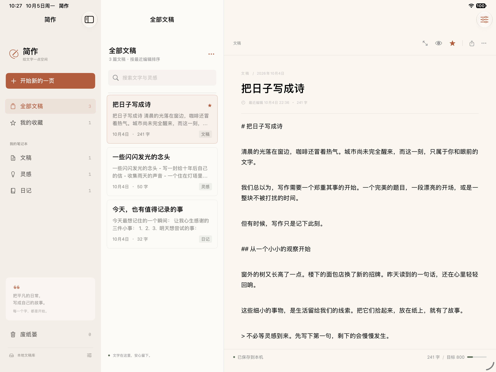

# Jianzuo · 简作

[中文](README.md) · **English**

A quiet, native writing space built with SwiftUI for **Mac, iPhone, and iPad**. One Xcode project, with no third-party dependencies.

[Download](https://github.com/mrlingan/jianzuo/releases) · [Release notes (Chinese)](Docs/Releases/v1.0.0.md) · [Report an issue](https://github.com/mrlingan/jianzuo/issues) · [Contribute](CONTRIBUTING.md)

## Screenshots

### Mac: notebooks, document list, and editor

Browse notebooks and favorites on the left, search and switch documents in the middle, and write on the right. The footer shows save status, word count, and the current document's writing goal.


<details>
<summary>See Markdown preview and focus mode</summary>

### Markdown preview

Use the eye icon or `⇧⌘P` to switch between Markdown source and a formatted preview of headings, paragraphs, lists, and quotations.


### Focus mode

Use the expand icon or `⇧⌘F` to hide navigation columns and concentrate on the current document. Toggle it again to return; on Mac, `Esc` also exits focus mode.


</details>

### iPhone / iPad: a workspace that adapts to the screen

iPhone uses a document list and a separate editing screen. Wider iPad windows show the list and editor side by side, with a sidebar that can be expanded when needed.

<table>
  <tr><th>iPhone · Writing</th><th>iPad · Browsing and writing</th></tr>
  <tr>
    <td align="center"></td>
    <td align="center"></td>
  </tr>
</table>

These are actual v1.0.0 screenshots using the included sample documents. Mobile screenshots were captured in iPhone / iPad simulators. **The app interface is currently in Chinese; the README is available in Chinese and English.**

## Features and how to use them

| Feature | Usage |
| --- | --- |
| Native editing | Create a document and edit its title and body. NSTextView on Mac and UITextView on iOS support Chinese input, text selection, and native undo. |
| Notebooks and search | Organize documents into Drafts (文稿), Ideas (灵感), or Journal (日记). Search matches titles and body text; documents are sorted by their latest edit. |
| Markdown preview | Toggle the eye icon to preview headings, bold, italics, links, quotations, ordered / unordered lists, fenced code blocks, and horizontal rules. |
| Favorites and organization | Use the star icon to favorite a document. The More menu can duplicate documents, move them to another notebook, or send them to Trash. Mac document cards also have a context menu. |
| Trash and recovery | Trashed documents can be restored. Permanent deletion requires confirmation and cannot be undone. |
| Import and export | Import UTF-8 Markdown / TXT from the document list's More menu. Export the body using the share icon: Markdown or TXT on Mac, Markdown on iOS. |
| Local autosave | Edits save about 450 ms after typing pauses, and immediately when the app leaves the foreground. Writes use atomic replacement; a library read failure preserves the original file and displays an error. |
| Counts and goals | Chinese characters count individually; English text counts by word. More → Document Statistics shows characters and estimated reading time. Choose a per-document goal in settings, or disable it. |
| Writing preferences | Choose Songti, the system font, or a monospaced font; adjust font size from 14 to 26 and line spacing; use system, light, or dark appearance. |
| Focus mode | Hide navigation columns while keeping the document and save status visible. Focus mode can be combined with Markdown preview. |

### Start writing

1. Select “开始新的一页” (Start a new page), then enter a title and body. Changes save automatically.
2. Organize documents into notebooks or star frequently used documents.
3. Use the eye icon to check formatting, or the expand icon to enter focus mode.
4. Export a Markdown copy when finished. You can import that file on another device.

### Mac keyboard shortcuts

| Shortcut | Action |
| --- | --- |
| `⌘N` | New document |
| `⌘O` | Import documents |
| `⌘S` | Save immediately |
| `⇧⌘E` | Export the current document |
| `⇧⌘P` | Toggle Markdown editing / preview |
| `⇧⌘F` | Toggle focus mode |
| `Esc` | Exit focus mode |

## Download and install

Packages and checksum files are available on [GitHub Releases](https://github.com/mrlingan/jianzuo/releases).

| Package | Purpose and requirements |
| --- | --- |
| Mac DMG / ZIP | macOS 14 or later; includes Apple Silicon (arm64) and Intel (x86_64). Move “简作.app” into Applications. |
| Unsigned iOS IPA | iOS / iPadOS 17 or later, arm64. Built directly from source, unencrypted and unsigned. **Re-sign with your own valid certificate and provisioning profile before installing on a device.** |
| iOS Simulator ZIP | For Xcode simulators only; cannot be installed on physical devices. The current package was built with the iOS 27 SDK. |

Mac packages use an ad-hoc signature and do not have Developer ID signing or Apple notarization. macOS may show a security prompt on first launch; verify the download source and follow the system instructions. The unsigned IPA has not been installed and tested on a physical iPhone or iPad.

Start a simulator, then run these commands from the directory containing the extracted simulator app:

```sh
xcrun simctl install booted Jianzuo.app
xcrun simctl launch booted com.jianzuo.writing
```

## Data and current scope

- Documents are stored locally in `Application Support/Jianzuo/library.json`. The sandboxed Mac app stores this inside its own container.
- Each device has an independent library. **iCloud sync is not implemented.** Use import / export to exchange files and regularly export important documents as backups.
- Exports contain the body, with the title used as the filename. Notebook assignment, favorite status, creation time, and other library metadata are not included.
- Markdown preview does not render images, tables, or HTML. Their source text is still preserved and exported.
- Writing goals apply to the current document, rather than a daily total.
- Documentation is bilingual; app-interface localization into other languages is not implemented.

## Run in Xcode

Minimum OS versions: macOS 14 and iOS / iPadOS 17. No third-party libraries are required.

1. Clone the repository and open `Jianzuo.xcodeproj`.
2. Select the `Jianzuo` scheme and `My Mac`, an iPhone simulator, or an iPad simulator, then press `⌘R`.
3. To run on a physical device, select your development team in Signing & Capabilities, connect the device, and run.

```sh
git clone https://github.com/mrlingan/jianzuo.git
cd jianzuo
open Jianzuo.xcodeproj
```

### Build and test

```sh
# Mac unit tests
xcodebuild -project Jianzuo.xcodeproj -scheme Jianzuo \
  -destination 'platform=macOS' -derivedDataPath Build/Mac \
  CODE_SIGNING_ALLOWED=NO test

# iOS simulator build
xcodebuild -project Jianzuo.xcodeproj -scheme Jianzuo \
  -sdk iphonesimulator -destination 'generic/platform=iOS Simulator' \
  -derivedDataPath Build/iOS CODE_SIGNING_ALLOWED=NO build
```

The six existing unit tests cover mixed-language counting, Unicode persistence round trips, search and favorites, trash restoration and deletion, corrupt-file protection, and incomplete Markdown code fences. For v1.0.0, all six passed on both Mac and the iOS simulator.

### Package a release

```sh
# Mac DMG / ZIP, simulator ZIP, unsigned device IPA, and checksums
bash Scripts/package_release.sh 1.0.0

# Unsigned device IPA only
bash Scripts/package_ipa.sh 1.0.0
```

Output: `Build/Releases/v1.0.0`. `SHA256SUMS.txt` covers Mac and simulator packages; the IPA has a separate `.ipa.sha256` file.

### Project layout

| Path | Contents |
| --- | --- |
| `Jianzuo/Models` | Documents, counts, local persistence, and library operations |
| `Jianzuo/Views` | Cross-platform UI, native editors, Markdown preview, and settings |
| `JianzuoTests` | Persistence and document-behavior tests |
| `Scripts` | Project generation, icon drawing, and release packaging |
| `Docs/Screenshots` | Actual UI screenshots used by the READMEs |
| `Docs/Releases` | Release notes |

`Scripts/create_project.py` regenerates the Xcode project and color assets. `Scripts/make_icon.swift` contains the native drawing code for the app icon.

## Contributing and license

Report bugs and suggest improvements through [Issues](https://github.com/mrlingan/jianzuo/issues), or submit a pull request. See [CONTRIBUTING.md](CONTRIBUTING.md) for development guidelines in Chinese.

Licensed under the [MIT License](LICENSE).
